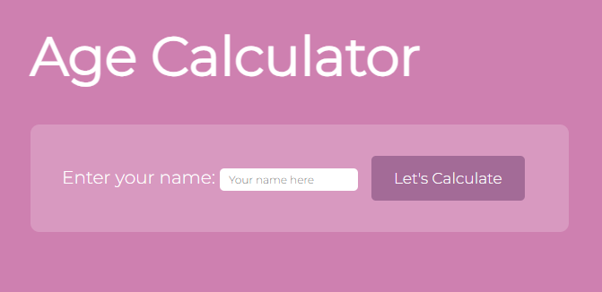
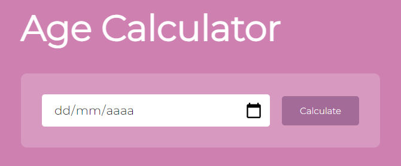
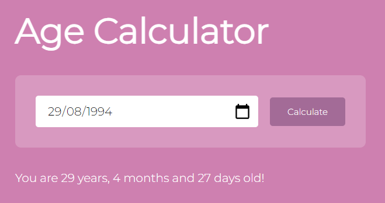

# Age-Calculator 🎰

An age calculator 🌻

## Demonstration

## Overview

The Age Calculator is a web application that allows users to calculate their age based on the entered birthdate. It provides a user-friendly interface to input the birthdate and view the calculated age.

## Features

- **Age Calculation:** Users can input their birthdate, and the application will calculate and display their age.
- **Responsive Design:** The application is designed to be responsive, providing a consistent user experience across different devices.

## Technologies Used

- **JavaScript:** Used for backend logic and age calculation.
- **HTML:** Markup language for creating the structure of the web pages.
- **CSS:** Styling language to enhance the visual presentation of the web pages.

## Upcoming Features

I'm working on improving with the following features:

- Implementing a choice of name for the users on a starting menu ✔️
- Implementing new style button and background, with CSS
- Add music and sound effects to make the experience more interactive